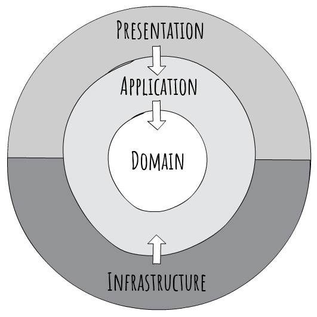

# Estructura de carpetas y contenido
- Carpeta src 
    - Código fuente de la aplicación.
- Carpeta docs 
    - Minuta de relevamiento en formato [.md](https://commonmark.org/)
    - Modelo de dominio en formato [.drawio](https://marketplace.visualstudio.com/items?itemName=hediet.vscode-drawio)
    - Carpeta images
        - Repositorio de imágenes para utilizar en los documentos.


# Arquitectura del proyecto


Con Clean Architecture, las capas Domain y Application son el centro del diseño. Esto se conoce como el Core del sistema.

La capa Domain contiene la lógica empresarial y la capa Application contiene la lógica de negocio. La diferencia es que la lógica empresarial se puede compartir entre varios sistemas, mientras que la lógica de negocio se usa generalmente solo dentro del sistema actual.

El Core no debe depender del acceso a datos ni de otras cuestiones de arquitectura, entonces esas dependencias se invierten. Esto se alcanza agregando interfaces o abstracciones dentro del Core, que son implementadas en las capas exteriores. Por ejemplo, si se quiere implementar el patrón Repositorio, esto se hace agregando la interface en el Core y haciendo la implementación en la capa Infrastructure.

Todas las dependencias fluyen hacia adentro, y el Core no tiene dependencia con ninguna otra capa. Las capas Infrastructure y Presentation dependen del Core, pero no estre ellas.

Fuente: [Clean Architecture with .NET Core: Getting Started](https://jasontaylor.dev/clean-architecture-getting-started/)

# Pasos para crear el proyecto con dotnet CLI
- Crear repositorio en Github.
- Crear carpeta local ConsultaAlumnosClean.
- En la consola de comandos, dentro de la carpeta ConsultaAlumnosClear
```
git init
git add README.md
git commit -m "first commit"
git branch -M main
git remote add origin https://github.com/efalabrini/ConsultaAlumnosClean.git
git push -u origin main
dotnet new gitignore
mkdir src
cd src
dotnet new webapi -f net8.0 -controllers -n Web
dotnet new classlib -n "Domain"
dotnet new classlib -n "Application"
dotnet new classlib -n "Infrastructure"
cd ..
dotnet sln ConsultaAlumnosClean.sln add src/**/*.csproj
cd src
dotnet add Application/Application.csproj reference Domain/Domain.csproj
dotnet add Infrastructure/Infrastructure.csproj reference Application/Application.csproj
dotnet add Web/Web.csproj reference Application/Application.csproj
dotnet add Web/Web.csproj reference Infrastructure/Infrastructure.csproj
rm -r **/Class1.cs
de ..
mkdir docs
```
# Para crear las Migraciones con dotnet CLI
- En la consola de comandos, posicionados en la carpeta /src
```
dotnet ef migrations add InitialMigration --context ApplicationDbContext --startup-project Web --project Infrastructure -o Data/Migrations -- --environment development
dotnet ef database update --context ApplicationDbContext --startup-project Web --project Infrastructure -- --environment development
```
Para borrar la última migración, deshaciendo los cambios en la base de datos
```
dotnet ef migrations remove -f --startup-project Web --project Infrastructure -- --environment development
```

# Configuración del proyecto
- Agregar en cada proyecto, las siguientes líneas
```
    <PropertyGroup>
        <RootNamespace>[SolutionName].[ProjectName]</RootNamespace>
        <AssemblyName>[SolutionName].[ProjectName]</AssemblyName>
    </PropertyGroup>
```
Ejemplo:
```
    <PropertyGroup>
        <RootNamespace>ConsultaAlumnosClean.Domain</RootNamespace>
        <AssemblyName>ConsultaAlumnosClean.Domain</AssemblyName>
    </PropertyGroup>
```

Para que los namespaces sean sugeridos según el RootNamespace en lugar de la carpeta donde se encuentra el archivo, y para que el nombre de los assembies

## Tests projects
Para crear los proyectos de testing
Posicionados en la carpeta tests


```
dotnet new xunit -o Domain.UnitTests
dotnet add Domain.UnitTests/Domain.UnitTests.csproj reference ../src/Domain/Domain.csproj
dotnet sln ../ConsultaAlumnosClean.sln add ../tests/Domain.UnitTests/Domain.UnitTests.csproj
cd Domain.UnitTests
rm UnitTest1.cs
```

```
dotnet new xunit -o Application.IntegrationTests
dotnet add Application.IntegrationTests/Application.IntegrationTests.csproj reference ../src/Application/Application.csproj
dotnet add Application.IntegrationTests/Application.IntegrationTests.csproj reference ../src/Infrastructure/Infrastructure.csproj
dotnet sln ../ConsultaAlumnosClean.sln add ../tests/Application.IntegrationTests/Application.IntegrationTests.csproj
cd Application.IntegrationTests
dotnet add package Moq --version 4.20.70
rm UnitTest1.cs
```
